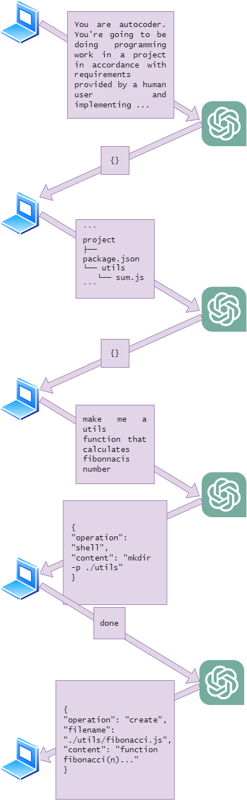

# 💻 Autocoder

> **Warning**
> Right now, the current prompt sometimes returns incorrectly formatted data that does not adhere to the protocol when used with the `gpt-3.5-turbo` model. Use `gpt-4` if you have access to the API.

## What is autocoder

Autocoder is a CLI utility that connects to OpenAI's ChatGPT, sends it the current project structure so the AI has some context and then listens for prompts for programming requirements from the user. The AI sends operations to the user's computer through the CLI and they're being executed, modifying the source code directly.

The AI is able to create, update and delete source files. It's also able to read files in case it needs more context to solve the issue. It's also able to execute shell scripts (seeking approval from the user first)

### Example use:

Call the cli using the following command. Make sure to include an OpenAI key you can get [here][openai-keys].

```sh
npx autocoder --key <api-key>
```

Alternatively, the API key can be inserted into the `OPENAI_API_KEY` env variable, in which case, you don't have to include the `--key` flag.

```sh
💻 Autocoder CLI started in /home/user/autocoder
Ignoring folders: node_modules
🌳 Sending project tree to ChatGPT
💻 Project was analyzed as Node.js
Enter your programming requirement (e.g. 'create a new header react component')
>make a utils function to calculate fibonnacis number

🚀 Autocode wants to execute the following command: mkdir -p ./utils? (y/n)
>y
Command executed successfully.

✏ Creating file ./utils/fibonnaci.js

Done.
```

## Protocol

The initial prompt tells ChatGPT to only answer in a JSON manner as if talking to an API. The first message sent to ChatGPT is the project structure, from which it infers the project type (for contextual purposes). It then responds to the prompt request by issuing commands in a specific JSON format which the CLI then executes.

Example:



<!-- links -->

[openai-keys]: https://platform.openai.com/api-keys
